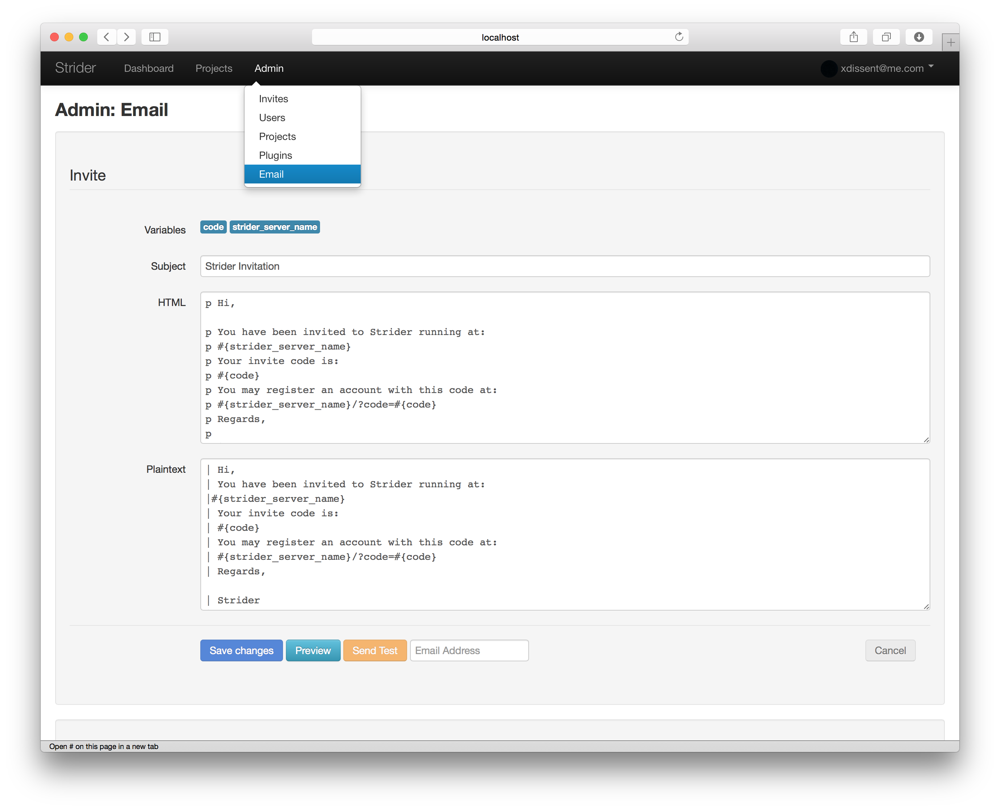

# strider-email-admin

> Manage [Strider](http://stridercd.com) email templates

## Features

* Edit all email templates from admin interface (subject, HTML and plaintext)
* Preview template changes
* Send test emails
* Jade rendering / variable substition (subject, HTML and plaintext)
* Stock Strider templates are used by default

## Todo

* Eliminate `base.html` overriding.
* Auto-prefix plaintext templates with pipe.
* Docs.
* Hijack `strider-email-notifier` templates.
